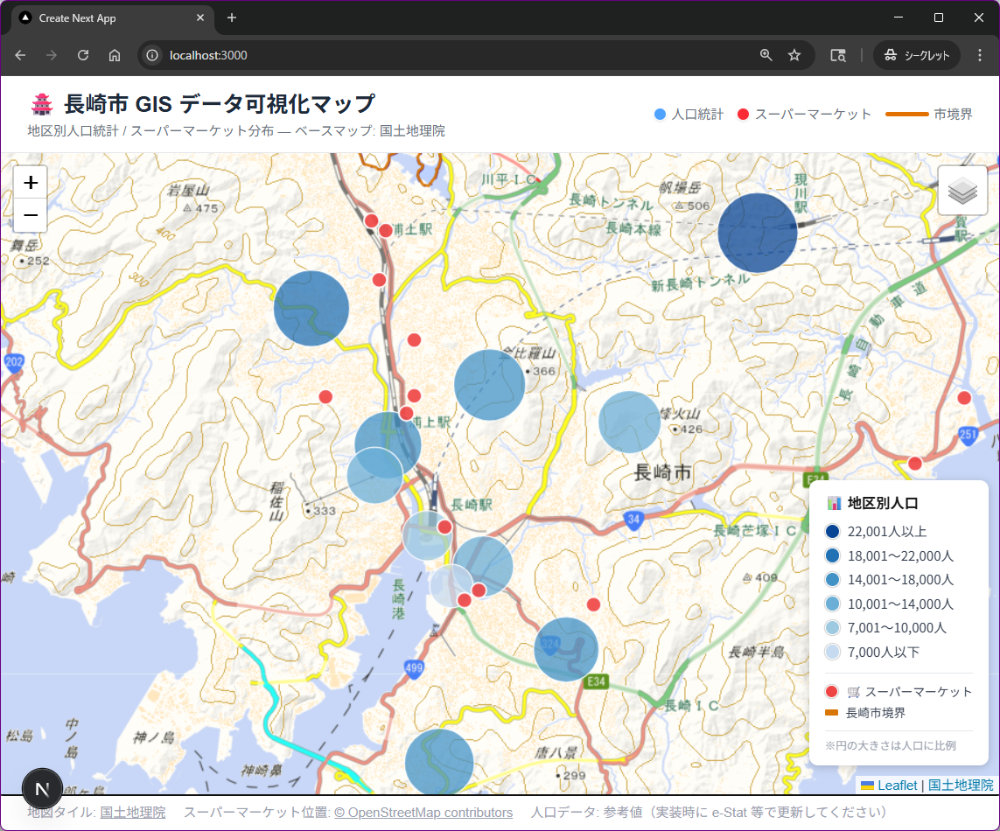

# 長崎市 GIS データ可視化マップ

長崎市の地図上に **市境界・地区別人口統計・スーパーマーケット分布** を重ねて表示するWebアプリです。

- **フレームワーク**: Next.js 16 (App Router)
- **地図ライブラリ**: react-leaflet
- **ベースマップ**: 国土地理院タイル / OpenStreetMap
- **データソース**: Nominatim API（市境界）、Overpass API（スーパー）、参考値JSON（人口統計）

## 表示例



## 表示機能

| レイヤー | 内容 |
|---|---|
| 長崎市境界 | オレンジ枠のアウトライン表示 |
| 人口統計（地区別） | 青系グラデーション円（人口に比例したサイズ） |
| スーパーマーケット | 赤丸マーカー（OSMデータ）|

右上のレイヤーコントロールで各レイヤーの表示/非表示を切り替えられます。

## ファイル構成

```
nagasaki-map/
├── app/
│   ├── globals.css
│   ├── layout.tsx
│   └── page.tsx              # ヘッダー・地図・フッター
├── components/
│   ├── NagasakiMap.tsx       # メイン地図コンポーネント
│   ├── MapWrapper.tsx        # SSR回避クライアントラッパー
│   └── MapLegend.tsx         # 凡例コンポーネント
└── public/data/
    ├── nagasaki-city.geojson # 長崎市境界（Nominatim取得）
    ├── supermarkets.json     # スーパーマーケット（Overpass API取得）
    └── population.json       # 地区別人口データ（参考値）
```

## セットアップ

### 必要環境

- Node.js 18 以上
- npm

### インストール

```bash
# リポジトリのクローン後、プロジェクトディレクトリへ移動
cd nagasaki-map

# 依存パッケージのインストール
npm install
```

## 起動方法

### 開発サーバー

```bash
npm run dev
```

ブラウザで [http://localhost:3000](http://localhost:3000) を開くとアプリが表示されます。

### 本番ビルド

```bash
# ビルド
npm run build

# 本番サーバー起動
npm run start
```

## データの更新

### 人口統計データ

`public/data/population.json` は参考値です。実データに差し替える場合は [e-Stat 国勢調査](https://www.e-stat.go.jp/) から長崎市の町丁目別人口データ（CSV）をダウンロードし、以下の形式に変換してください：

```json
[
  {
    "id": 1,
    "name": "地区名",
    "lat": 32.7503,
    "lng": 129.8777,
    "population": 12345,
    "area_km2": 2.5
  }
]
```

### スーパーマーケットデータ

最新データが必要な場合は以下のURLで再取得し、`public/data/supermarkets.json` を上書きしてください：

```
https://overpass-api.de/api/interpreter?data=[out:json][timeout:25];node["shop"="supermarket"](32.3,129.5,33.1,130.1);out body;
```

## データ出典

- 地図タイル：[国土地理院](https://maps.gsi.go.jp/development/ichiran.html)
- スーパーマーケット位置：© [OpenStreetMap](https://www.openstreetmap.org/copyright) contributors
- 人口データ：参考値（本番利用時は [e-Stat](https://www.e-stat.go.jp/) で更新）

## 開発ドキュメント

### `docs/plan-nagasakiGisMap.prompt.md`

**GitHub Copilot の Plan モード**で作成した実装計画書です。Copilot との対話を通じて要件を整理し、実装手順・設計判断・検証結果を記録しています。以下の内容を含みます：

- **実装ステップ**：プロジェクト作成からビルド確認までの手順（実際に実行した内容・ハマりポイント含む）
- **データスキーマ**：`population.json` のフィールド定義と地図上での利用方法
- **Verification**：実施確認済みの動作検証項目
- **Decisions**：ライブラリ選定・API選定などの設計判断の根拠
- **Known Issues / TODO**：人口データの実データ差し替えや町丁目境界の追加実装など残課題

> 次回の機能追加や他プロジェクトへの横展開時に参照することで、同じ試行錯誤を繰り返さずに済みます。
